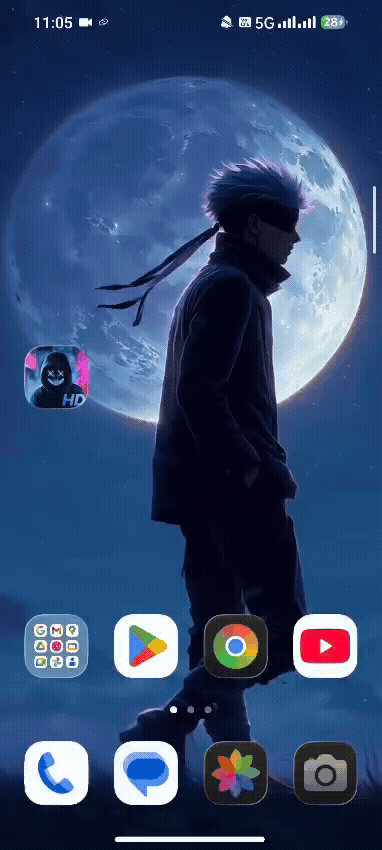

# Live Wallpaper Studio 🎬✨

A modern Android application that allows users to set their own videos as live wallpapers for both the home and lock screens. It also supports setting static images from the gallery.

## 📱 Screenshots

| APP UI | PHONE HOMESCREEN |
|:---:|:---:|
|  |  |

## 🎥 Demo

Check out the app in action:


## ✨ Features

*   **Live Video Wallpaper**: Convert any video from your gallery into a smooth live wallpaper.
*   **Static Wallpaper**: Set high-quality photos as your background.
*   **Modern UI**: Clean and intuitive interface built with Jetpack Compose.
*   **Performance**: Optimized for high frame rates (up to 120fps) and battery efficiency.
*   **Auto-Mute**: Automatically mutes video audio for a distraction-free experience.

## 🛠️ Tech Stack

*   **Language**: Kotlin
*   **UI**: Jetpack Compose (Material 3)
*   **Media**: Android MediaPlayer API
*   **Architecture**: MVVM-inspired structure

## 🚀 How to Run

just Download apk file 
and chose install anyway .
then chose the video and set to it as a live wallpaper

1.  Clone the repository:
    ```bash
    git clone https://github.com/dilsec20/Live_Wallpaper.git
    ```
2.  Open in Android Studio.
3.  Build and Run on your device.

---
*Built with ❤️ by Dilip*
